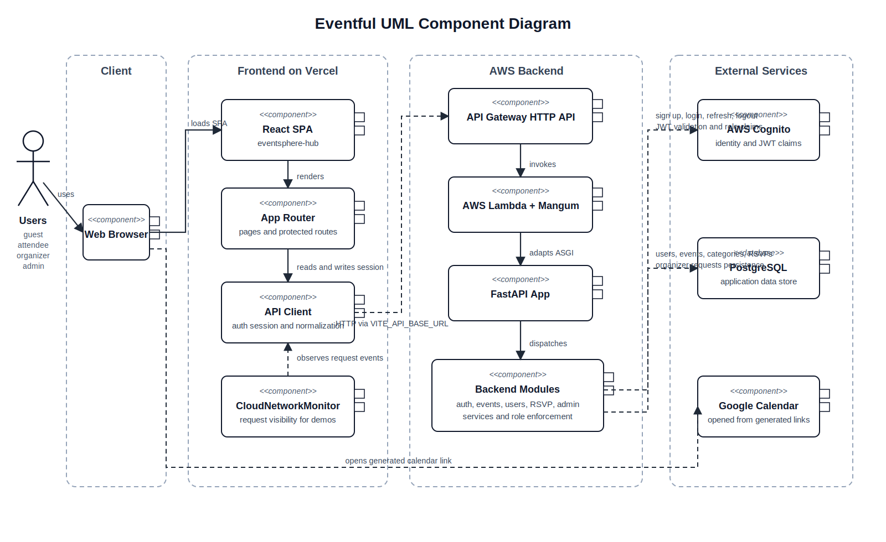
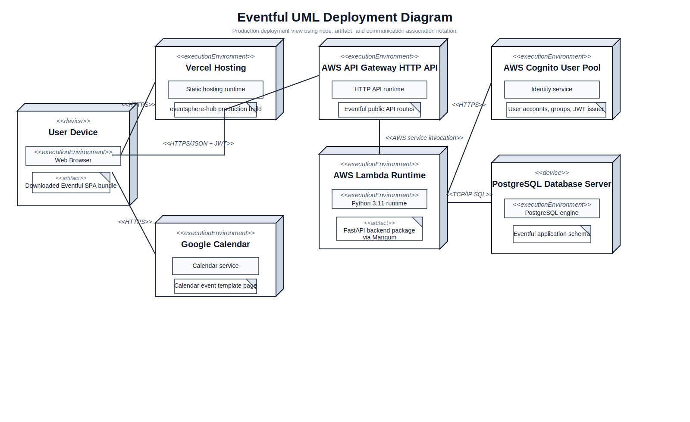
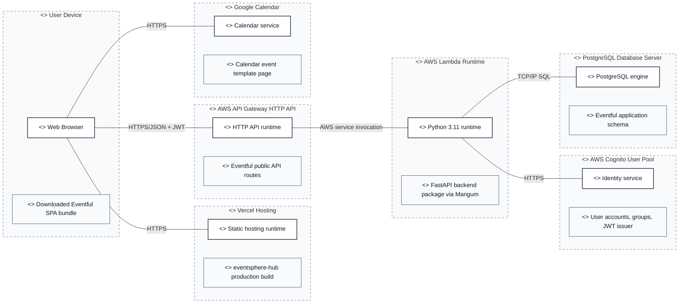

# Eventful

Eventful is a full-stack event discovery and event management platform built for a CMPE 202 team project. The system supports three roles: attendees discover and register for events, organizers create and manage events, and admins moderate platform activity. The implementation is split between a React frontend, a FastAPI backend, AWS Cognito for authentication, and PostgreSQL for application data.

The project was designed around a practical platform workflow instead of a static catalog. That means event publishing is moderated, registration is capacity-aware, user roles are enforced end to end, and the frontend is wired to live cloud APIs rather than mock data.

## Problem Statement

Most event apps solve only part of the workflow: discovery, hosting, or moderation. Eventful was built to connect those concerns in one system:

- guests should be able to browse public events without friction
- attendees should be able to register, manage tickets, and track upcoming events
- organizers should be able to publish and manage events without getting direct admin power
- admins should be able to approve content, manage privileges, and keep the platform controlled

## Overall Feature Set

### Guest Features

- browse approved events from the public catalog
- search events by keyword
- filter events by category
- open event detail pages without signing in
- view organizer info, event schedule, location, and capacity for approved events

### Attendee Features

- sign up with email and password through AWS Cognito
- confirm email before first login
- sign in and sign out, with refresh-token support available in the backend auth API
- maintain a local user profile in the application database
- RSVP to approved events
- cancel an existing RSVP
- view personal registrations in the `My Tickets` page
- add registered events to Google Calendar through generated calendar links
- request promotion from attendee to organizer

### Organizer Features

- create events with title, description, category, schedule, location, coordinates, and capacity
- manage only their own events
- edit existing events
- automatically resubmit edited events for approval
- cancel their own events
- view all events they created in the organizer dashboard
- inspect attendee lists for events they own

### Admin Features

- review all events across the platform
- review only pending events for moderation
- approve events
- reject events with a required rejection reason
- review organizer upgrade requests
- approve or reject organizer requests
- list all users
- promote attendee users to admin
- revoke admin access

### Platform Features

- JWT-based authentication with Cognito-backed role claims
- backend role enforcement for attendee, organizer, and admin actions
- approved-only public event listing
- event lifecycle tracking through moderation states
- category management tied to event creation and discovery
- capacity-aware registration logic
- frontend API normalization to keep UI components stable
- cloud request monitor for demo-time visibility into frontend-to-backend calls
- Alembic migrations for schema evolution
- automated frontend and backend test coverage for core behaviors

## UI Wireframes

The wireframes below are low-fidelity, desktop-first sketches of the implemented UI. They are meant to show layout, information grouping, and user flow coverage across guest, attendee, organizer, and admin experiences.

### Global App Shell

```text
+------------------------------------------------------------------+
| [Eventful]  [ Search events...                ]  Browse  User Menu|
+------------------------------------------------------------------+
|                                                                  |
|                     Active Page Content Area                      |
|                                                                  |
|                                                [Cloud Monitor]    |
+------------------------------------------------------------------+
| Footer: browse links | sign in/up | profile | organizer | admin  |
+------------------------------------------------------------------+
```

- The sticky header matches the shared layout in `Header.jsx`, including logo, search, browse navigation, and role-aware account actions.
- The content area is filled by the routed pages in `App.jsx`.
- The cloud monitor sits outside the page content and stays available as a persistent demo/debug utility.

### Guest Discovery: Home

```text
+--------------------------------------------------------------+
| HERO                                                         |
| "Discover events that move you"                              |
| [ Search events, categories, cities... ] [ Search ]          |
+--------------------------------------------------------------+
| BROWSE BY CATEGORY                                            |
| [Music] [Business] [Food] [Community] [Arts] [Tech] ...      |
+--------------------------------------------------------------+
| UPCOMING EVENTS                                               |
| [ Event Card ] [ Event Card ] [ Event Card ] [ Event Card ]  |
+--------------------------------------------------------------+
| HOST YOUR OWN EVENT CTA                                       |
| "Reach attendees, manage RSVPs..."     [ Get started ]        |
+--------------------------------------------------------------+
```

- This matches the implemented `Home` page: hero search, category tiles, upcoming event cards, and organizer CTA.
- The home screen is optimized for first-time discovery and quick entry into browse or sign-up flows.

### Guest Discovery: Browse

```text
+----------------------+---------------------------------------+
| FILTERS              | RESULTS                               |
| Search               | Browse events                         |
| [ keyword...... ]    | 24 events                             |
|                      |                                       |
| Category             | [ Event Card ] [ Event Card ]        |
| [ All categories v ] | [ Event Card ] [ Event Card ]        |
|                      | [ Event Card ] [ Event Card ]        |
| Sort                 |                                       |
| [ Soonest first v ]  |                                       |
|                      |                                       |
| [ ] Free events only |                                       |
| [ Clear filters ]    |                                       |
+----------------------+---------------------------------------+
```

- This mirrors the real `Browse` page with a left filter rail and a responsive event card grid.
- Query params drive the filters for keyword, category, price flag, and sorting.
- Empty, loading, and error states remain in the same overall layout rather than switching to a different page shape.

### Event Detail

```text
+--------------------------------------------------------------+
| COVER IMAGE / HERO BANNER                                    |
+--------------------------------------------------------------+
| [Back to browse]                                             |
| EVENT TITLE                     [Category] [Free] [Past?]    |
+-----------------------------------+--------------------------+
| MAIN CONTENT                      | RSVP / STATUS SIDEBAR    |
| Date & Time card                  | Free / Paid              |
| Location card                     | Spots left               |
|                                   | [ RSVP ] / [ Cancel ]    |
| About this event                  | [ Add to Calendar ]      |
| Schedule                          | Registration state       |
| Embedded map                      |                          |
| Organizer card                    |                          |
+-----------------------------------+--------------------------+
```

- This matches the real `EventDetail` layout: content-heavy left column, action-oriented right column.
- The page supports guest viewing, attendee RSVP state, Google Calendar access, and organizer information in one screen.
- Back navigation, badges, map embed, and schedule blocks are part of the implemented detail experience.

### Attendee Workflow

```text
+--------------------------------------------------------------+
| AUTH                                                         |
| [ Sign in ] [ Sign up ]                                      |
| Name / Email / Password / Confirmation Code                  |
| Role choice: ( ) Attend events   ( ) Host events             |
| [ Create account ] / [ Sign in ]                             |
+--------------------------------------------------------------+
| PROFILE                                                      |
| Email                                                        |
| [attendee] [organizer?] [admin?]                             |
| Name field                                                   |
| [ Save changes ]  [ Request organizer access ]               |
+--------------------------------------------------------------+
| MY REGISTRATIONS                                             |
| [Upcoming] [Past]                                            |
| +----------------------------------------------------------+ |
| | Event image | title | date | location | code | actions | |
| |                               [ Calendar ] [ Cancel ]   | |
| +----------------------------------------------------------+ |
+--------------------------------------------------------------+
```

- This section covers the attendee-facing routes `/auth`, `/profile`, and `/tickets`.
- Authentication supports sign-up, sign-in, email confirmation, and an organizer-intent path at registration time.
- Profile editing and organizer-request actions are separated from the registration management screen.
- The tickets view centers on confirmation codes, event summaries, calendar access, and cancellation.

### Organizer Workflow

```text
+--------------------------------------------------------------+
| ORGANIZER DASHBOARD                                          |
| Total events | Upcoming | Total RSVPs    [ Create event ]    |
|--------------------------------------------------------------|
| Your events table                                            |
| Event | Date | Status | RSVPs | View | Attendees | Edit | X  |
+--------------------------------------------------------------+
| EVENT FORM                                                   |
| Basic info: title, description, category                     |
| Date & time: start, end                                      |
| Location: venue, address, city, state, country               |
| Capacity                                                     |
|                                         [ Submit for review ]|
+--------------------------------------------------------------+
| ATTENDEE LIST                                                |
| registration id | attendee email | quantity | status | time  |
+--------------------------------------------------------------+
```

- This section covers `/organizer`, `/organizer/events/new`, `/organizer/events/:id/edit`, and `/organizer/events/:id/attendees`.
- The dashboard is table-driven and status-aware, reflecting pending, approved, rejected, and cancelled event states.
- Create and edit share the same form structure, which is why they are represented as one wireframe.
- Attendee inspection is a dedicated organizer-only follow-up screen connected from the dashboard row actions.

### Admin Moderation

```text
+--------------------------------------------------------------+
| ADMIN                                                        |
| Events | Pending events | Users | Organizer requests         |
+--------------------------------------------------------------+
| STATS                                                        |
| [Events] [Pending] [Users] [Organizer requests]              |
+--------------------------------------------------------------+
| TABS                                                         |
| [ Pending ] [ All events ] [ Organizer requests ] [ Users ]  |
+--------------------------------------------------------------+
| ACTIVE TAB CONTENT                                           |
| Pending events table                                         |
| Event | Organizer | Date | Status | [Approve] [Reject]       |
|--------------------------------------------------------------|
| Organizer requests table                                     |
| Request | User | Role | [Approve] [Reject]                   |
|--------------------------------------------------------------|
| Users table                                                  |
| User | Email | Role | [Promote admin] [Revoke admin]         |
+--------------------------------------------------------------+
| REJECT EVENT DIALOG                                          |
| Reason textarea                                              |
| [ Cancel ]                                  [ Reject event ] |
+--------------------------------------------------------------+
```

- This wireframe maps to the tabbed `AdminDashboard` implementation and covers all admin-facing cases in one control surface.
- Moderation is split across pending events, all events, organizer requests, and user role management.
- Rejecting an event is not an inline toggle only; it opens a dedicated reason dialog, which is represented here explicitly.

## Architecture Overview

The GitHub-rendered Mermaid view below keeps the architecture editable in the README. The static SVG after it uses stricter UML component notation for the same runtime architecture.

```mermaid
flowchart LR
    classDef component fill:#ffffff,stroke:#111827,stroke-width:1.5px,color:#111827;
    classDef datastore fill:#f8fafc,stroke:#111827,stroke-width:1.5px,color:#111827;
    classDef observer fill:#ffffff,stroke:#111827,stroke-width:1.5px,stroke-dasharray: 4 2,color:#111827;

    user([Guest / Attendee / Organizer / Admin])

    subgraph client["Client"]
        direction TB
        browser["<<component>><br/>Web Browser"]
    end

    subgraph frontend["Frontend on Vercel"]
        direction TB
        spa["<<component>><br/>React SPA<br/>eventsphere-hub"]
        routes["<<component>><br/>App Router + Pages"]
        api["<<component>><br/>API Client + Auth Session<br/>src/lib/api.js"]
        monitor["<<component>><br/>CloudNetworkMonitor"]
    end

    subgraph aws["AWS Backend"]
        direction TB
        gateway["<<component>><br/>API Gateway HTTP API"]
        lambda["<<component>><br/>AWS Lambda + Mangum"]
        fastapi["<<component>><br/>FastAPI App"]
        backend["<<component>><br/>Auth / Events / Users / RSVP / Admin"]
    end

    subgraph external["Data / External Services"]
        direction TB
        cognito["<<component>><br/>AWS Cognito"]
        postgres[("PostgreSQL")]
        calendar["<<component>><br/>Google Calendar"]
    end

    class user,browser,spa,routes,api,gateway,lambda,fastapi,backend,cognito,calendar component
    class postgres datastore
    class monitor observer
    style client fill:#f8fafc,stroke:#64748b,stroke-width:1px,stroke-dasharray: 5 5
    style frontend fill:#f8fafc,stroke:#64748b,stroke-width:1px,stroke-dasharray: 5 5
    style aws fill:#f8fafc,stroke:#64748b,stroke-width:1px,stroke-dasharray: 5 5
    style external fill:#f8fafc,stroke:#64748b,stroke-width:1px,stroke-dasharray: 5 5

    user -->|uses| browser
    browser -->|loads SPA| spa
    spa -->|renders| routes
    routes -->|reads and writes session state| api
    monitor -.->|observes browser request events| api
    api -.->|HTTP via VITE_API_BASE_URL| gateway
    gateway -->|invokes| lambda
    lambda -->|adapts ASGI| fastapi
    fastapi -->|dispatches| backend
    backend -.->|sign up, login, refresh,<br/>logout, JWT claims| cognito
    backend -.->|users, events, categories,<br/>registrations, organizer requests| postgres
    browser -.->|opens generated calendar link| calendar
```





Eventful uses a browser-based single-page frontend and a serverless backend:

1. The React frontend in `eventsphere-hub` runs on Vite and is deployed to Vercel.
2. The frontend calls the FastAPI backend through a configured API base URL.
3. The backend runs behind AWS API Gateway and AWS Lambda using Mangum and the SAM template in `backend/template.yaml`.
4. AWS Cognito handles sign-up, confirmation, login, logout, token issuance, and group-based role claims.
5. PostgreSQL stores application entities such as users, events, categories, registrations, and organizer requests.

## Deployment Diagram

This view focuses on where Eventful runs in production rather than how the code is decomposed internally. The SVG below is the primary UML deployment diagram and follows the node-and-artifact style described in the [Agile Modeling deployment diagram reference](http://agilemodeling.com/artifacts/deploymentDiagram.html) and the companion [deployment diagram guidelines](https://agilemodeling.com/style/deploymentDiagram.htm). The Mermaid block mirrors the same production topology in a GitHub-editable form.





## Tech Stack

- Frontend: React 18, Vite, React Router, Tailwind CSS, shadcn/ui, TanStack Query, Vitest
- Backend: FastAPI, SQLAlchemy, Alembic, Mangum, Pydantic, Pytest
- Authentication: AWS Cognito
- Database: PostgreSQL
- Cloud deployment: AWS Lambda, API Gateway, AWS SAM
- Frontend deployment: Vercel

## Core Domain Model

- `User`: local application record tied to a Cognito `sub`, with `attendee`, `organizer`, or `admin` role
- `Event`: organizer-owned event with category, schedule, location, capacity, and moderation status
- `Category`: reusable event classification used for browsing and filtering
- `Registration`: attendee RSVP record with quantity and status
- `OrganizerRequest`: workflow record for attendee-to-organizer upgrade requests

## Design Decisions

### 1. Separate Attendee, Organizer, and Admin Roles

The system uses three explicit roles because event consumption, event publishing, and platform moderation are different responsibilities. This keeps the authorization model simple and makes privilege boundaries visible in both the frontend and backend.

### 2. Organizer Access Is Approved, Not Self-Assigned

An attendee can request organizer access, but an admin must approve it. This avoids letting any authenticated user immediately publish events and gives the platform a review step before granting publishing power.

### 3. Events Follow a Moderated Lifecycle

Events move through `pending_approval`, `approved`, `rejected`, and `cancelled`. This lifecycle supports moderation, explains why some events are public and some are not, and lets the admin dashboard serve as a real control surface instead of a decorative page.

### 4. Public Reads Are Open, Mutations Stay Protected

Browsing approved events is public because discovery should have low friction. Creating events, updating profile data, RSVPing, viewing personal registrations, and all admin actions require authentication and role checks.

### 5. Cognito Owns Identity, PostgreSQL Owns App State

Cognito manages account identity and token claims, while PostgreSQL stores application-specific records and profile updates. This split avoids rebuilding authentication internally while still giving the app control over roles, names, events, and workflow data.

### 6. Thin Routers, Business Logic in Services

The FastAPI routers mainly validate input and dispatch to service functions. Business rules such as category resolution, event moderation behavior, capacity checks, and registration cancellation live in service modules so the code stays easier to test and extend.

### 7. Serverless Backend for Simpler Deployment

The backend is packaged for Lambda and API Gateway through AWS SAM. For a class project, this reduces infrastructure management while still demonstrating a cloud-native deployment model.

### 8. Organizer Edits Trigger Re-Approval

When an organizer edits an event, the backend resubmits it for approval and clears any previous rejection reason. This ensures moderation applies to the latest version of event content, not only to the original submission.

### 9. Registration Logic Is Capacity-Aware

RSVP creation checks event status, prevents duplicate active registrations, and enforces the event capacity before committing. That decision keeps registration state aligned with the real event limits instead of treating RSVP as a simple bookmark.

### 10. Calendar Integration Uses Generated Links

The platform generates Google Calendar template URLs instead of building a full calendar sync subsystem. This provides immediate attendee value with much lower implementation complexity.

### 11. The Frontend Normalizes Backend Responses in One API Layer

The frontend centralizes response normalization inside `eventsphere-hub/src/lib/api.js`. This isolates UI pages from backend naming differences and makes the page components easier to keep stable during backend iteration.

### 12. Demo Observability Matters

The `CloudNetworkMonitor` component shows recent frontend-visible API traffic and backend endpoint metadata. This was a deliberate choice to make integration status easy to demonstrate during testing, review, and presentation.

## Role Workflow Summary

- Guests can browse approved events immediately.
- New users register through Cognito and enter the system as attendees by default.
- Attendees can RSVP to approved events and request organizer access.
- Organizers can create or edit events, but those events must pass admin review before public listing.
- Admins control platform moderation, organizer approvals, and admin privilege assignment.

## Repository Structure

```text
.
├── backend/
│   ├── app/                  # FastAPI app, routers, models, services, auth helpers
│   ├── requirements.txt
│   ├── template.yaml         # AWS SAM serverless deployment template
│   └── tests/                # Backend tests
├── docs/                     # README architecture diagram assets
├── eventsphere-hub/          # React/Vite frontend application
├── migrations/               # Alembic migration scripts
├── alembic.ini
└── README.md
```

## Local Development

### Backend

From the repository root, make sure the backend environment variables are set, install dependencies, run migrations, and start FastAPI:

```bash
cd backend
pip install -r requirements.txt
cd ..
alembic upgrade head
cd backend
uvicorn app.app:app --reload
```

### Frontend

Start the React frontend from `eventsphere-hub`:

```bash
cd eventsphere-hub
npm install
npm run dev
```

## Required Environment Variables

### Backend

- `DATABASE_URL`: PostgreSQL connection string used by SQLAlchemy and Alembic
- `COGNITO_CLIENT_ID`: Cognito app client ID used for login and token validation
- `COGNITO_USER_POOL_ID` or `USER_POOL_ID`: Cognito user pool ID
- `AWS_REGION` or `AWS_DEFAULT_REGION`: region used for Cognito and AWS service clients

### Frontend

- `VITE_API_BASE_URL`: base URL for the deployed or local backend API
- `VITE_AUTH_TOKEN_TYPE`: token type sent as bearer auth, defaulting to `access`

### Optional Backend Flags

- `ENABLE_SQLALCHEMY_CREATE_ALL`: creates tables at startup when explicitly enabled
- `ENABLE_TEST_DB_ENDPOINT`: exposes the `/test-db` endpoint when explicitly enabled

## API Surface Summary

The backend is organized around these route groups:

- `/auth`: sign up, confirm, login, refresh, logout
- `/users`: profile read/update, organizer upgrade request, admin user listing
- `/events`: public browse/detail, organizer create/update/cancel, organizer attendee list
- `/rsvp`: create RSVP, cancel RSVP, list current user's registrations
- `/admin`: event moderation, organizer request review, admin role management

## Testing

### Frontend

```bash
cd eventsphere-hub
npm test
```

### Backend

```bash
cd backend
pytest
```

## Project Outcome

Eventful is not just a UI mockup or an isolated API. It is a connected platform with public discovery, protected workflows, moderation gates, role-based access control, and cloud deployment wiring. The main engineering focus of the project was to make those pieces work together as one coherent system.
